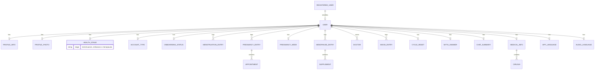

<div align="center">

# 🌸 Mairin

**Acompañante digital de salud femenina para Nicaragua**


</div>

---

## 🔗 Tabla De Contenido

- [Acerca Del Proyecto](#acerca-del-proyecto)
- [Estado Funcional](#estado-funcional)
- [Stack Técnico](#stack-técnico)
- [Requisitos](#requisitos)
- [Configuración Local](#configuración-local)
- [Scripts Disponibles](#scripts-disponibles)
- [Variables De Entorno](#variables-de-entorno)
- [Arquitectura](#arquitectura)
- [Backend De IA (Chat MAIRIN)](#backend-de-ia-chat-mairin)
- [Estructura Del Repositorio](#estructura-del-repositorio)
- [Convenciones](#convenciones)
- [Solución De Problemas](#solución-de-problemas)
- [Contribución](#contribución)

---

## Acerca Del Proyecto

**Mairin** es una aplicación móvil (iOS/Android) construida con React Native y Expo, pensada para acompañar a las mujeres nicaragüenses en las diferentes etapas de su salud reproductiva: **menstruación, embarazo y menopausia**.

La aplicación adapta su contenido y funcionalidades según la etapa de salud declarada por la usuaria, ofreciendo:

- Un calendario de seguimiento personalizado por etapa.
- Recordatorios inteligentes de citas médicas, suplementos y posible llegada del período.
- Un espacio de apoyo emocional con inteligencia artificial (MAIRIN).
- Contenido educativo verificado, con soporte para texto y audio en Español, y traducción parcial al Miskito.
- Herramientas prácticas: lista de doctores, números de emergencia, generación de reporte médico en PDF.

---

## Estado Funcional

Este proyecto está en desarrollo activo. Estado actual, de forma honesta:

| Funcionalidad | Estado |
|---|---|
| Calendario por etapa (menstruación/embarazo/menopausia) | ✅ Funcional |
| Recordatorios y notificaciones locales | ✅ Funcional |
| Chat de apoyo emocional con IA (MAIRIN) | ✅ Funcional (requiere backend desplegado y clave de OpenAI activa) |
| Transcripción de voz a texto | ✅ Funcional (requiere compilación nativa, no funciona en Expo Go) |
| Traducción de interfaz (Español / Miskito) | 🟡 Parcial — algunas pantallas convertidas, otras pendientes |
| Contenido en Miskito | 🟡 Parcial — algunas secciones tienen traducción real, otras usan marcadores temporales en inglés que **deben** reemplazarse antes de producción |
| Autenticación de usuarias | 🟡 Básica — actualmente basada en almacenamiento local del dispositivo (no hay backend de autenticación real ni sincronización entre dispositivos) |
| Aislamiento de datos por usuaria | ✅ Funcional — los datos están asociados a la cuenta autenticada y cada usuaria solo puede acceder a sus propios registros

---

## Stack Técnico

**Aplicación móvil**
- [Expo](https://expo.dev/) (SDK 57) + [Expo Router](https://docs.expo.dev/router/introduction/)
- React Native + TypeScript
- `@react-native-async-storage/async-storage` — persistencia local
- `expo-notifications` — recordatorios y notificaciones
- `expo-speech` / `expo-audio` — texto a voz y grabación de audio
- `react-native-calendars` — calendario visual
- `@react-native-community/datetimepicker` — selector de fecha/hora
- `expo-image-picker` / `expo-document-picker` — selección de imágenes y archivos
- `@expo/vector-icons` (Ionicons)
- `@react-native-firebase/auth` — instalado, disponible para una futura migración a autenticación real

**Backend de IA** (proyecto separado, desplegado en Vercel)
- Node.js (funciones serverless)
- `openai` SDK — GPT (chat) y Whisper (transcripción de voz)
- `formidable` — manejo de carga de archivos de audio

---

## Requisitos

- **Node.js** (versión LTS reciente)
- **npm**
- **Expo CLI** (`npx expo`, no requiere instalación global)
- **Xcode** + **CocoaPods** (para compilar y ejecutar en iOS)
- **Android Studio** (para compilar y ejecutar en Android, incluye el SDK y el emulador)
- **Watchman** (recomendado, mejora la velocidad de recarga del bundler)

```bash
brew install watchman
```

---

## Configuración Local

### 1. Clonar el repositorio e instalar dependencias

```bash
git clone <url-del-repositorio>
cd mairin
npm install
```

### 2. Verificar compatibilidad de dependencias con el SDK de Expo

```bash
npx expo install --check
```

Si se reportan paquetes desactualizados:

```bash
npx expo install --fix
```

### 3. Iniciar el servidor de desarrollo

```bash
npx expo start -c
```

El flag `-c` limpia la caché de Metro; es recomendable usarlo después de instalar dependencias nuevas o cambiar rutas.

### 4. Generar una compilación nativa (requerida para audio/voz)

Algunas funciones (grabación de voz, ciertas notificaciones) no funcionan completamente dentro de **Expo Go** y requieren una compilación nativa personalizada:

```bash
npx expo prebuild
```

**iOS:**
```bash
cd ios
pod install
cd ..
npx expo run:ios
```

**Android:**
```bash
npx expo run:android
```

> Para Android, es necesario tener un emulador creado y **encendido manualmente** desde Android Studio (`Tools → Device Manager`) antes de ejecutar `npx expo run:android`, o un dispositivo físico conectado con depuración USB habilitada.

---

## Scripts Disponibles

| Comando | Descripción |
|---|---|
| `npx expo start` | Inicia el servidor de desarrollo (Metro) |
| `npx expo start -c` | Igual, pero limpiando la caché |
| `npx expo run:ios` | Compila y ejecuta en iOS (dev client) |
| `npx expo run:android` | Compila y ejecuta en Android (dev client) |
| `npx expo prebuild` | Genera/regenera las carpetas nativas `ios/` y `android/` |
| `npx expo prebuild --clean` | Regenera las carpetas nativas desde cero |
| `npx expo install --check` | Verifica compatibilidad de dependencias con el SDK |

---

## Variables De Entorno

La aplicación móvil **no** almacena ninguna clave secreta directamente (por diseño, para evitar exponerla en el bundle de la app).

El backend de IA (repositorio separado) requiere una variable de entorno configurada en el panel de Vercel:

| Variable | Descripción |
|---|---|
| `OPENAI_API_KEY` | Clave de API de OpenAI, usada por las funciones `/api/chat`, `/api/summary` y `/api/transcribe` |

Esta clave se configura desde **Vercel → Configuración del proyecto → Environment Variables**, nunca dentro del código.

---

## Arquitectura

### Modelo de datos (local, por dispositivo)



> **Importante:** `USER` es conceptual, no una entidad real. Cada elemento del diagrama corresponde a su propia clave independiente en `AsyncStorage`, sin una separación real entre distintas cuentas en el mismo dispositivo. `REGISTERED_USER` solo valida correo/contraseña localmente; no existe sincronización con un servidor.

### Idiomas y accesibilidad

El sistema de traducción funciona mediante un diccionario centralizado (`translations/index.ts`) y un contexto global (`LanguageContext`), que expone una función `t(clave)` usada en toda la aplicación. El audio se controla de forma independiente mediante `useSpeak`, que respeta tanto el idioma activo como la preferencia de audio de la usuaria.

---

## Backend De IA (Chat MAIRIN)

El chat de apoyo emocional depende de un **backend independiente** (repositorio separado), desplegado en Vercel, que actúa como intermediario seguro entre la aplicación y la API de OpenAI.

| Endpoint | Función |
|---|---|
| `POST /api/chat` | Recibe el mensaje de la usuaria y el historial de conversación; devuelve la respuesta de MAIRIN |
| `POST /api/summary` | Genera un mensaje motivador breve al finalizar la conversación |
| `POST /api/transcribe` | Recibe un archivo de audio y devuelve su transcripción en texto (Whisper) |

Este backend nunca debe alojarse dentro del repositorio de la app móvil, ya que debe mantenerse y desplegarse de forma independiente.

---

## Estructura Del Repositorio

```
mairin/
├── src/
│   ├── app/
│   │   ├── (auth)/          # Inicio de sesión, registro, onboarding
│   │   ├── (tabs)/           # Pantallas principales (Inicio, Calendario, Ayuda, Apóyanos, Perfil)
│   │   ├── chat-mairin.tsx   # Chat de apoyo emocional
│   │   └── aboutUs.tsx        # "¿Quiénes somos?"
│   ├── components/            # Componentes reutilizables
│   ├── contexts/               # Contexto global de idioma
│   ├── hooks/                   # Hooks personalizados (ej. texto a voz condicional)
│   ├── services/                 # Frases, voz, predicción de ciclo
│   ├── storage/                   # Persistencia local, un archivo por función
│   ├── styles/                     # Estilos y colores globales
│   ├── translations/                # Diccionario Español / Miskito
│   └── utils/                        # Notificaciones, recordatorios, edad
├── ios/                                # Generado por `expo prebuild`
├── android/                             # Generado por `expo prebuild`
└── app.json

mairin-chat-backend/                      # Repositorio/carpeta separada
├── api/
│   ├── chat.js
│   ├── summary.js
│   └── transcribe.js
└── package.json
```

---

## Convenciones

- **Un archivo de almacenamiento por función**, dentro de `storage/` (ej. `menstruationStorage.ts`, `pregnancyStorage.ts`), cada uno con su propia clave de `AsyncStorage`.
- **Traducciones centralizadas**: ninguna pantalla debe contener texto traducido manualmente; toda cadena traducible se agrega como clave en `translations/index.ts` y se consume mediante `t("clave")`.
- **Voz condicionada**: cualquier texto que incluya audio debe usar `speakIfEnabled` (o el componente `SpeakableText`), nunca llamar `speakText` directamente, para respetar tanto el idioma como la preferencia de audio de la usuaria.
- **Rutas ocultas de la barra de pestañas**: toda pantalla secundaria dentro de `(tabs)/` que no deba mostrarse como pestaña debe registrarse con `options={{ href: null }}` en `(tabs)/_layout.tsx`.

---

## Solución De Problemas

**Error de CocoaPods relacionado con `gRPC-Core` / módulos estáticos**
Agregar `:modular_headers => true` explícitamente a los pods de Firebase/gRPC en el `Podfile`, y un `post_install` que fuerce `DEFINES_MODULE = 'YES'` para `gRPC-Core`.

**Error `Cannot find native module` (ExpoAsset, ExponentConstants, ExpoAudio, etc.)**
Generalmente indica una discrepancia de versiones entre el SDK de Expo y sus paquetes, o que se está usando Expo Go en lugar de una compilación nativa personalizada.

```bash
npx expo install --fix
rm -rf node_modules
npm install
npx expo start -c
```

**El teclado no aparece en el simulador de iOS**
El simulador puede tener activado el teclado físico de macOS. Alternar con `Cmd + Shift + K` (Teclado de software) desde el menú **I/O** del simulador.

**Error "insufficient quota" o "credit balance too low" en el chat**
La clave de API de OpenAI/Anthropic configurada en Vercel no tiene saldo o método de pago asociado. Debe agregarse crédito desde la consola del proveedor correspondiente.

**No se detecta ningún emulador de Android**
Debe crearse y **encenderse manualmente** un dispositivo virtual desde `Android Studio → Device Manager` antes de ejecutar `npx expo run:android`.

---

## Contribución

1. Crear una rama a partir de la rama principal.
2. Seguir las convenciones de traducción y almacenamiento descritas arriba.
3. Verificar que cualquier texto nuevo tenga su clave correspondiente en `translations/index.ts` (Español y, cuando esté disponible, Miskito verificado).
4. Probar en un dispositivo o compilación nativa real antes de enviar cambios que afecten notificaciones, audio o voz, ya que estas funciones no se comportan igual dentro de Expo Go.

---

## ⚠️ Aviso Importante

Mairin tiene fines **educativos y de acompañamiento personal**. La aplicación **no reemplaza** el diagnóstico, tratamiento ni la orientación de un profesional de la salud.

Las traducciones al Miskito marcadas como temporales dentro del código **deben ser verificadas por hablantes nativos** antes de su uso en producción, especialmente al tratarse de contenido de salud.
